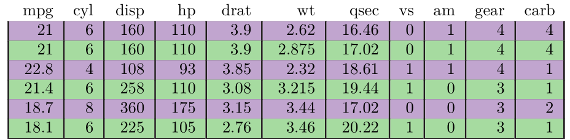
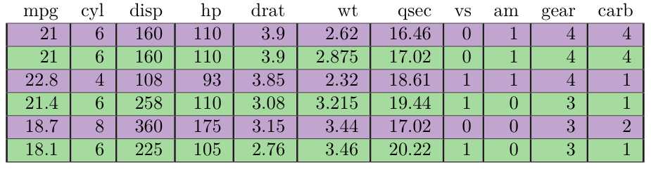

--- 
title: "Get Your Sparkle On"
subtitle: "A Guide to Using the Magic of `pixiedust`"
author: "Benjamin Nutter"
date: "`r Sys.Date()`"
output:
  bookdown::gitbook:
    config:
      toc:
        collapse: section
        scroll_highlight: true
        before: null
        after: null
      theme: null
  bookdown::pdf_book:
    keep_tex: yes
documentclass: book
bibliography: 
biblio-style: apalike
link-citations: yes
github-repo: nutterb/pixiedust
description: "A Guide to Formatting Tables with the Pixiedust Package"
---

```{r, warning = FALSE, message = FALSE, echo = FALSE}
library(dplyr)
library(ggplot2)
library(magrittr)
library(pixiedust)
library(RColorBrewer)
library(tidyr)

palette <- brewer.pal(9, "PRGn")

options(pixie_bookdown = TRUE,
        pixie_interactive = FALSE)
```

# Introduction

```{r results="asis", echo=FALSE}
get_your_sparkle_css <- "
<style>
.book .book-body .page-wrapper .page-inner section.normal table
{
  width:auto;  
  border-collapse:collapse;
  border-spacing:2px;
}
.book .book-body .page-wrapper .page-inner section.normal table td,
.book .book-body .page-wrapper .page-inner section.normal table th,
.book .book-body .page-wrapper .page-inner section.normal table tr
{
  padding:2;
  border:0;
  background-color:#fff;
}
</style>
"

cat(get_your_sparkle_css)
```

Tables are a powerful tool for communicating information. They are pervasive in statistical literature in many forms. We see them in text books as references for standard normal probabilities. Some tables organize analysis methods for differing strata in a population. We may even find tables displaying conference schedules.

For statisticians, the table is an inevitable tool for conveying the results of any variety of statistical tables. In some cases, we begin to rely on a specific style of table we like for a specific kind of analysis, such as one we might use in exploratory data analysis. Other times, we may need to custom fit a table to a rare or novel analysis worthy of special attention.

Creating tables in R is not a new endeavor. Many have attempted it, and many have performed it well. Perhaps most notably, the `xtable` package has streamlined the process of turning table - like objects into presentation - ready formats. Likewise, `knitr`'s `kable` function provides a rapid and reliable method to convert two dimensional grids into aesthetically pleasing tables.

Beyond table - like objects, `xtable` and `stargazer` packages make conversion of non-table-like objects into tabular representations simple and dependable.

In addition to these packages, a multitude of packages have popped up on CRAN to facilitate the creation of tables. These include `tableHTML`, `htmlTable`, `condformat`, and `ReporteRs`. Each of these has strengths and weaknesses - which we will not enumerate here-and each of these are good packages.

So why, then, do we concern ourselves with `pixiedust`, yet _another_ R package for creating tables?

In short, it is because `pixiedust` offers a simple, consistent interface for fine tuned customization of each and every cell of the table.

## `pixiedust` Design Constraints

The `pixiedust` package was envisioned with a unique set of constraints. These constraints can be separated into categories involving the data, the user interface, and the output.  These constraints guide the development of `pixiedust` and the philosophy of table customization.

### Data Constraints

Within any cell of the table

1. The underlying data may be formatted, but not changed.
2. The user must be able to obtain the original object upon request.

This means that, no matter what customizations you make to a cell, the data will never be altered until the table is actually printed. In other words, you can eliminate a vast amount of any pre-processing to the data you may have needed to do in the past. Furthermore, if you inadvertently make a `dust` object from your data, you can restore the data without any loss of information.

Consider the following simple example.  With `pixiedust`, we are able to round the first, second, and third rows to two decimal places, and the fourth and fifth rows to four decimal places.

```{r, results = 'asis'}
library(pixiedust)
options(pixiedust_print_method = "html")
set.seed(1)
Example <- data.frame(sample_id = 1:5,
                      random = rnorm(5)) %>%
  dust() %>%
  sprinkle(rows = 1:3, 
           round = 2) %>%
  sprinkle(rows = 4:5,
           round = 4) %>%
  sprinkle_print_method("html") 

Example %>% print(asis = FALSE) %>% cat()
```

In most other packages, this type of formatting can't be done without some preprocessing.  Additionally, even though we've saved `Example` as a `dust` object, the core data is easily retrieved.

```{r}
as.data.frame(Example, sprinkled = FALSE)
```


### User Interface Constraints

1. The interface must have as few functions as possible.
2. The user should be able to apply as many customizations to a cell as is desired in one call.
3. The user should be able to designate rows and columns by positional reference and named reference.

`pixiedust` comes with two core functions. The `dust` function converts an object to a tabular structure associated with its formatting choices.  The `sprinkle` function acts on the `dust` object to change those associations as directed by the user.  `dust` is described in more detail in Section \@ref(dust-anatomy). Chapter \@ref(chapter-sprinkles) is dedicated to the details of sprinkling.

Additionally, there are some variants on `sprinkle`, namely `sprinkle_colnames` for changing how column names are printed in the table; `sprinkle_table` for applying a sprinkle to multiple parts of a table (header, body, and footer); and `sprinkle_print_method` for changing the print method for a table.  

Some less commonly used functions that are included with the package are `pixieply`, a variant of `mapply` that permits `sprinkle` to function over a list of `dust` objects; an `as.data.frame` method for converting `dust` objects to data frames; and a `print` method.

Lastly, there are a handful of utility functions for managing table numbering.  These can be seen by calling `?pixie_count`.

The `sprinkle` function has only four formal arguments.  The massive flexibility of `pixiedust` on such a simple interface is made possible by a flagrant abuse of the `...` argument (really, I don't think `...` should ever be treated like it is in `pixiedust`).  This approach allows the user to call as many defined sprinkles as desired without any action being taken on sprinkles that aren't requested.

### Output Constraints

1. The user may choose to output to the console, markdown, HTML, or LaTeX.
2. The interface must be identical for all outputs.
3. When customizations do not apply to an output format, the request will be quietly ignored.
4. When working in Rmarkdown scripts, the output format should be automatically detected, but may be altered by the user.
5. Table numbering should be automatic and handled internally.

`pixiedust` currently supports output to the console, markdown, HTML and LaTeX (PDF), and an engine to output `ReporteRs` formatted tables is in the works.  All of these outputs are controlled using the same interface.  This has advantages over packages such as `xtable`, where some customizations must be written to a specific output, meaning they can't be transferred from one output format to another.

Not all of the customizations are relevant to every format.  For example, backgrounds and borders are not supported by console or markdown output.  Font families are supported in HTML, but not in LaTex.  When a sprinkle is applied that isn't supported by the format, the request is stored in the `dust` object, but is quietly ignored at the `print` request.  The advantage to this arrangement is that there are no errors for applying a sprinkle to an unsupported format.  The disadvantage is that you may not always realize that your sprinkle won't show up in your output.  Generally, I find that being able to have near-identical tables across multiple formats to outweigh the disadvantage.

Since `pixiedust` is intended to work with Rmarkdown scripts, it is unnecessary to explicitly declare the output format. `pixiedust` will make use of `knitr::opts_knit$get("rmarkdown.pandoc.to")` to determine the output format for you and make the appropriate adjustments.

One last important feature of `pixiedust` is that, by design, it imposes the minimum intervention possible.  If you are using CSS (HTML) templates or LaTeX templates, the settings in those templates should only be superceded by `pixiedust` when the user requests it explicitly.  The tables displayed in this manual have two Cascading Style Sheet (CSS) elements defined: the space between cells is 2 pixels (only applies with `border-collapse:separate`), and the cell paddign is set to 2 pixels.  These settings have been chosen only to help the reader visualize the effect each call has on the table output.  Depending on the templates on which your reports are based, the output may differ slightly from what is displayed here.

### `pixiedust` Is Not ...

While `pixiedust` is partially motivated by `ggplot` graphics, it does _not_ purport to be a grammar of any sort, and does not pretend to have a structured philosophy about how to build tables. It simply does what it is told.

Additionally, `sprinkles` should not be considered layers.  Any changes made to a cell will simply overwrite previous changes, and will not allow any interaction.

A last note of caution before you move on to the documentation: be careful not to over-format your tables.  It can be tempting, but the content of the table should speak for itself.  Customizations to the tables should merely guide the reader's eye to the important information. The customizations you make should never scream at the reader.

With that, I hope you enjoy using `pixiedust` as much as I have. If you have questions, problems, frustrations, or suggestions, please submit an issue to the [GitHub repository](https://github.com/nutterb/pixiedust/issues) or send me an e-mail: benjamin.nutter@gmail.com

<!--chapter:end:index.Rmd-->

# `dust`ing Objects

```{r results="asis", echo=FALSE}
cat(get_your_sparkle_css)
```

> ...no one can fly unless the fairy dust has been blown on him. Fortunately, as we have mentioned, one of [Peter's] hands was messy with it, and he blew some on each of them, with the most superb results.
>
> "Now just wiggle your shoulders this way," he said, "and let go."
>
> They were all on their beds, and gallant Michael let go first. He did not quite mean to let go, but he did it, and immediately he was borne across the room.
>
> "I flewed!" he screamed while still in mid-air.

--J.M. Barrie, _Peter Pan_, Ch. 3, Come, Come Away

The primary feature of the `pixiedust` package is very fine control over each individual cell of a table.  This level of control requires maintaining attributes of the output for each cell separately.  Tabular structures as we like to view them are not well suited to storing all of these attributes, and so the `dust` function is used to convert a tabular object into a particular format where we are able to set and alter the display attributes at will.

The underlying mechanics of `dust`ing objects aren't particularly interesting, and for most users, it is sufficient to know that you must apply an initial dusting of pixiedust before you can begin sprinkling specific columns with your desired magic.  If you choose to read beyond the table-wide options created during `dust`, you will learn more about the anatomy of the `dust` object itself.

## Table-wide options {#table-wide-options}

Table wide options are those options that necessarily apply to the entire table. These may include the caption, the justification on the page, the total width of the table, etc.  The table-wide options in the dust object are listed below:

### `caption`

The `caption` option determines the text that is placed above the table, and is usually used to provide a summary of the table, or used as a title.  When a caption is given, it is numbered automatically by `pixiedust`.

```{r, results = 'asis'}
dust(head(mtcars),
     caption = "The first six lines of mtcars")
```

### `border_collapse`

Relevant only to HTML tables, the `border-collapse` option determines if the borders of a table should overlap (or lay on top of) each other. When set to `FALSE`, a small space will appear between the cell borders.  


```{r, results = 'asis'}
dust(head(mtcars),
     border_collapse = 'collapse',
     caption = "A table with <font face = 'Courier New'>border_collapse = 'collapse'</font>") %>%
  sprinkle(border = "all")

dust(head(mtcars),
     border_collapse = 'separate',
     caption = "A table with <font face = 'Courier New'>border_collapse = 'separate'</font>") %>%
  sprinkle(border = "all") 
```

By default, `border_collapse = TRUE` when a `dust` object is created.

### `justify`

The `justify` option determines the horizontal placement of the entire table on the page.  The option may be given `"center"`, `"left"`, or `"right"`, and defaults to `"center"`. This setting has no effect on the horizontal alignment of the contents of a table's cells.

The default value for this option is `"center"`.

```{r, results = 'asis'}
dust(head(mtcars),
     justify = "center",
     caption = "Center-justified Table")
```

```{r, results = 'asis'}
dust(head(mtcars),
     justify = "left",
     caption = "Left-justified Table")
```

```{r, results = 'asis'}
dust(head(mtcars),
     justify = "right",
     caption = "Right-justified Table")
```

### `longtable`

This option is named after the LATEX package `longtable`, which is used to break tables with many rows into multiple parts. Each part of the broken table is displayed on a separate page.  The default value of the `longtable` option in `pixiedust` is `FALSE`, which retains the table as one unit.  

If the table is too long to display on a page, you may set the value to `TRUE` or to an integer value. The behavior of `pixiedust` will vary slightly, depending on your output type.  

When `longtable = TRUE` and the output is LATEX, the table will be divided according to the settings in the LATEX document.  For all other formats, the table will be divided such that each table has no more than 25 rows.

When `longtable` is an integer, each section of the table will contain no more than that number of rows, regardless of the format.  In all formats, each section of the table will retain the header component of the `dust` object.  The last section of table will have the `foot` object, and all other sections will have the `interfoot` object at its end.  If the table has a caption, each section of the table will retain the caption and all will have the same number.

```{r, results = 'asis'}
dust(head(mtcars),
     longtable = FALSE,
     caption = "The table caption") 

dust(head(mtcars),
     longtable = 2,
     caption = "Notice that the multiple sections of table have the same number")
```

Use of headers and footers in conjunction with the `longtable` option is covered in more detail in Chapter \@ref(chapter-header-footer)

### `label`

The `label` option accepts a string that makes a LATEX like label to associate with the table.  The label may then be used to make references to the table from elsewhere in the document.  These labels work with LATEX output, and with HTML output when `bookdown = TRUE`. 

```{r, results = 'asis'}
dust(head(mtcars),
     caption = "A table that has a label",
     label = "label-ref",
     bookdown = TRUE)
```

When choosing to reference the table above as Table \@ref(tab:label-ref), you must use the label with a `tab:` prefix.  For the above example, we used `tab:label-ref`.

### `float`

This option impacts only LATEX output.  It determines if the table is placed in a floating environment (that is, one that can be moved based on the LATEX engine's decision of optimal location for the typesetting). By default, this is `TRUE`.  You may set it to `FALSE` to force the table to appear where it occurs relative to the rest of your document.  No example is generated here, as it has no impact on HTML output.

### `hhline`

This is another option that impacts only LATEX output.  When using colored cell backgrounds in conjunction with cell borders, the default LATEX cell borders can be overwritten by the colored backgrounds.  If you wish to have the cell borders _and_ colors, you should set `hhline = TRUE`. Note, however, that this may restrict you to using solid cell borders, as the dashed borders are not supported by `hhline`.  (Or maybe it's colored dashed borders.  I need to look into that again.  But in any case, simplicity is probably your friend here).

An illustration of the difference is provided below.

```{r, eval = FALSE}
dust(head(mtcars),
     float = FALSE,
     hhline = FALSE,
     caption = "A LaTeX Table with \\texttt{hhline = FALSE}. Notice that the borders between rows are not evident as requested in the code.") %>%
  sprinkle(bg_pattern = c("#C2A5CF", "#A6DBA0")) %>%
  medley_all_borders() %>%
  sprinkle_print_method("latex")
```

```{r, echo = FALSE, results = 'asis'}
data.frame(x = "",
           stringsAsFactors = FALSE) %>%
  dust(caption = "A LaTeX Table with <font face = 'Courier New'>hhline = FALSE</font>. Notice the borders between rows are not evident as requested in the code.") %>%
  sprinkle_colnames("")
```

```{r, message = FALSE}
dust(head(mtcars),
     float = FALSE,
     hhline = TRUE,
     caption = "A LaTeX Table with \\texttt{hhline = TRUE}. Notice that the borders between rows are readily apparent using the hhline option.") %>%
  sprinkle(bg_pattern = c("#C2A5CF", "#A6DBA0")) %>%
  medley_all_borders() %>%
  sprinkle_print_method("latex")
```

```{r, echo = FALSE, results = 'asis'}
data.frame(x = "",
           stringsAsFactors = FALSE) %>%
  dust(caption = "A LaTeX Table with <font face = 'Courier New'>hhline = FALSE</font>. Notice that the borders between rows are readily apparent using the hhline option..") %>%
  sprinkle_colnames("") %>%
  print(asis = FALSE) %>%
  cat()
```

### `bookdown`

If you are using the `bookdown` package, it is recommended that you set `bookdown = TRUE` so that you may make use of `bookdown`'s referencing syntax, which supports HTML references. Important features to note are:

1. Observe how the table numbering changes between previous tables and the table below.  
2. We are unable to make a reference the table below as an HTML table (though we could still reference a LaTeX table).

```{r, results = 'asis'}
dust(head(mtcars),
     caption = "A table with the <font face = 'Courier New'>bookdown</font> option turned off.",
     label = "label-ref",
     bookdown = FALSE) 
```

By default, `pixiedust` uses `bookdown = FALSE`. However, this book was written using `bookdown = TRUE` using the options described in section \@ref(#dust-setting-options-globally).


### Setting Options Globally {#dust-setting-options-globally}

Most of the options discussed above may be set as a global option.  Doing so will reduce the code required to apply these settings to each table.  The code below shows an example of how to set all of the available options to the default values.

```{r, eval =  FALSE}
options(pixie_float = TRUE,
        pixie_longtable = FALSE,
        pixie_hhline = FALSE,
        pixie_bookdown = FALSE)
```

## Anatomy of the `dust` Object {#dust-anatomy}

Now let's get into the nitty-gritty and take a look at what `dust` is doing to your objects.

To start, let's first recognize that `dust` is dependent of having tabular data.  The first thing it will try to do is force any object it receives into a two-dimensional table.  If, for example, you give it an `lm` object, `dust` will attempt to normalize the object to a data frame via the `tidy` methods in the `broom` package.  

Once the object has been coereced to a data frame, `dust` will break the table into two parts: the header, and the body.  A footer may be added to objects that have a `glance` method when `glance_foot = TRUE`, otherwise, it is assumed there is no footer.  It is always assumed there is no interfoot; if this feature is desired it must be added later using the `redust` function.  Details on these features are discussed more in Chapter \@ref(chapter-header-footer).

The key feature of `pixiedust` is its ability to offer fine control over each and every cell of the table.  To accomplish this, it is necessary to build a reference table that maps each cell to it's attributes.  

Let us consider the table below:

```{r}
example <- 
  data.frame(x1 = c("r1, c1", "r2, c1", "r3, c1"),
             x2 = c("r1, c2", "r2, c2", "r3, c2"),
             x3 = c("r1, c3", "r2, c3", "r3, c3"),
             stringsAsFactors = FALSE)

example
```

The layout of the body of the table is formed in the `body` component of the `dust` object after reshaping the data frame as follows:

```{r}
example %>%
  mutate(row = 1:n()) %>%
  gather_("col", "value", 
         names(example)[!names(example) %in% "row"]) %>%
  mutate_(col_name = ~factor(col, colnames(example)),
                   col = ~as.numeric(col_name),
                   col_name = ~as.character(col_name),
                   value = ~as.character(value))
```

Notice that for a simple 3x3 table, a data frame of nine rows is required to begin to capture the cell attributes, which we have not yet displayed.  An additional three cells are required in the `head` object when the header has only one row.  In general, the cell attributes of each table are captured in a data frame with $r \times c$ rows where $r$ is the number of rows in the table, and $c$ is the number of columns.

Let's take a look at the `body` component of the `dust`ed `example` table.

```{r}
tbl <- dust(example)

tbl[["body"]]
```

We take note that the `body` component is a data frame with `r nrow(tbl[["body"]])` rows and `r ncol(tbl[["body"]])` columns.  This is a much larger data frame than the initial object, which accounts for both the bloated size of dust objects  (`example` is `r format(as.numeric(object.size(example)), big.mark = ",")` bytes while `tbl` is `r format(as.numeric(object.size(tbl)), big.mark = ",")` bytes). 

It also accounts for the slowness of `pixiedust` when compared to other table generating functions like `knitr::kable` and `xtable`.   `pixiedust` runs in about 20 milliseconds to process `example` without any sprinkles, while it takes `knitr::kable` about 1 millisecond.  These speed differences are indiscernable to humans for one table at a time, but if you will be processing hundreds or thousands of tables that need to be completed quickly (such as in a web application), `pixiedust` may not be your best option. But for individual tables that require fine-tuned formatting, it is a good compromise of control and ease of use.

<!--chapter:end:01-Dust.Rmd-->

# Headers and Footers {#chapter-header-footer}

<!--chapter:end:02-TableHeadersAndFooters.Rmd-->

# Sprinkling {#chapter-sprinkles}

```{r results="asis", echo=FALSE}
cat(get_your_sparkle_css)
```

The `dust` function structures the table with the most basic preparations for printing.  Customizations to the table are added by _sprinkling_ your table with additional pixiedust.  

The full list of available sprinkles is provided in one of `pixiedust`'s [vignettes](https://cran.r-project.org/web/packages/pixiedust/vignettes/sprinkles.html). some of the sprinkles apply to the entire table, and some will apply only to selected cells.  

## Table-valued Sprinkles

While `dust` offers a mechanism for applying certain attributes to the entire table, it is also permissible to assign these attributes through sprinkles.  Whether the attribute is set using `dust` or `sprinkle`, the effect is the same.  Table-valued sprinkles have the same name as the arguments described in Section \@ref(table-wide-options).

We won't bother exploring all of these sprinkles here, but will provide a single example with the `caption` sprinkle, shown in Table \@ref(tab:sprinkle-caption).

```{r, results = 'asis'}
dust(head(mtcars)) %>%
  sprinkle(caption = "This caption was defined in the sprinkle function",
           label = "sprinkle-caption") 
```

The full list of table-valued sprinkles is given in Table \@ref(tab:sprinkle-table-valued-sprinkle).

```{r, echo = FALSE, results = 'asis'}
system.file(package = "pixiedust", "sprinkle_reference.csv") %>%
  read.csv %>%
  filter(group == "option") %>%
  select(sprinkle) %>%
  dust(caption = "Table Valued Sprinkles",
       label = "sprinkle-table-valued-sprinkle") %>%
  sprinkle(width = 200,
           bg_pattern_by = "rows") %>%
  medley_bw()
```

## Cell-valued Sprinkles

The primary feature of `pixiedust` is the ability to fine-tune each individual cell in a table.  Cell-specific customizations in other packages often require indexing changes in long function calls with multiple arguments that can make it difficult to easily relate the customization to the targeted cells.  

`pixiedust` provides a wide array of customizations, including background colors, borders, bold and italic text, fonts, and font colors.  The following sections will elaborate on how to apply sprinkles to a table.  Section \@ref(sprinkle-gallery) provides a gallery of each of the sprinkles and their affect on a table. 

### Cell Selection

#### Cell Selection by Index

The first step in applying sprinkles is identifying the cells in the table you wish to modify.  Tabular data lends itself nicely to a two dimensional coordinate system.  `pixiedust` relies on standard matrix indexing notation where rows are indexed sequentially starting with one at the top row.  Columns are indexed sequentially starting with one at the left.

When referencing cell coordinates, keep in mind that each part of the table is indexed separately.  This means that the body of the table has a [1,1] position, as does the head, the foot, and the interfoot.  Sprinkles applied to position [1,1] of the head of a table will have no effect on the [1,1] position of the body of the table.  Compare Tables \@ref(tab:sprinkle-head) and \@ref(tab:sprinkle-body).

```{r, results = 'asis'}
dust(head(mtcars),
     caption = "Cell Indexed Sprinkle on the Header Only",
     label = "sprinkle-head") %>%
  medley_bw() %>%
  sprinkle(rows = 1, 
           cols = 1,
           font_color = "red",
           part = "head")

dust(head(mtcars),
     caption = "Cell Indexed Sprinkle on the Body Only",
     label = "sprinkle-body") %>%
  medley_bw() %>%
  sprinkle(rows = 1, 
           cols = 1,
           font_color = "red",
           part = "body")
```

When multiple cells are to be modified, the default behavior is to apply the sprinkle to the intersection of rows and columns designated.  This makes `sprinkle` pretty greedy in how it assigns modifications; making identical modifications to disjointed sections of code is not its default behavior.  Table \@ref(tab:sprinkle-region1) applies a purple background to the four cells in the top left corner.  Compare this with Table \@ref(tab:sprinkle-region2), where the sprinkling is performed in all four corners.

```{r, results = 'asis'}
dust(head(mtcars),
     caption = "Sprinkling applied to the four cells in the top left corner",
     label = "sprinkle-region1") %>%
  sprinkle(rows = 1:2,
           cols = 1:2,
           bg = palette[3]) %>%
  medley_bw() 

dust(head(mtcars),
     caption = "Sprinkling applied to the four cells in each corner.",
     label = "sprinkle-region2") %>%
  sprinkle(rows = c(1:2, 5:6),
           cols = c(1:2, 10:11),
           bg = palette[3]) %>%
  medley_bw() 
```

The behavior of sprinkling in Table \@ref(tab:sprinkle-region2) can be elaborated using `expand.grid`. The call shown below identifies all of the cell coordinates where the sprinkle was applied.

```{r}
expand.grid(rows = c(1:2, 5:6),
            cols = c(1:2, 10:11))
```

If the table we desired were to have purple cells only in the top-left and lower-right corners, we would have to apply two `sprinkle`s, as shown for Table \@ref(tab:sprinkle-region3)

```{r, results = 'asis'}
dust(head(mtcars),
     caption = "Sprinkling applied to the four cells in each corner.",
     label = "sprinkle-region3") %>%
  sprinkle(rows = c(1:2),
           cols = c(1:2),
           bg = palette[3]) %>%
  sprinkle(rows = c(5:6),
           cols = c(10:11),
           bg = palette[3]) %>%
  medley_bw()
```

#### Cell Selection by Column Name

Sprinkling your table by index may be intuitive, but it isn't entirely reproducible. Fortunately, the `cols` argument in `sprinkle` also accepts character vectors.  Using column names has a number of advantages, such as improving readability of the code and simplifying programmatic use.  It also means that you will get the same results even if new columns are introduced to the table after it is generated.  Compare Table \@ref(tab:sprinkle-colname1) with Table \@ref(tab:sprinkle-region1) and the code to generate these tables. 

```{r, results = 'asis'}
dust(head(mtcars),
     caption = "Sprinkling applied to the four cells in the top left corner",
     label = "sprinkle-colname1") %>%
  sprinkle(rows = 1:2,
           cols = c("mpg", "cyl"),
           bg = palette[3]) %>%
  medley_bw() 
```


<!-- #### Cell Selection with Row Logic -->

<!-- Rows for sprinkling may be selected using logical conditions to improve reproducibility as well.  Table \@ref(tab:sprinkle-logical-row1) recreates Table \@ref{tab:sprinkle-region1} using row logic and column names.  Table \@ref(tab:sprinkle-logical-row2) shows an example of sprinkling statistically significant terms in a linear model using row logic.  When using logical rows, it is necessary to wrap the expression in `quote` to delay the execution of the command until `sprinkle` is ready to determine the results from the internal `dust` objects. -->

<!-- ```{r, results = 'asis'} -->
<!-- dust(head(mtcars), -->
<!--      caption = "Sprinkling applied to the four cells in the top left corner", -->
<!--      label = "sprinkle-logical-row1") %>% -->
<!--   sprinkle(rows = quote(mpg == 21), -->
<!--            cols = c("mpg", "cyl"), -->
<!--            bg = palette[3]) -->

<!-- fit <- lm(mpg ~ qsec + factor(gear) + wt, data = mtcars) -->

<!-- dust(fit, -->
<!--      caption = "Sprinkling a Model Summary with Column Names and Row Logic", -->
<!--      label = "sprinkle-logical-row2") %>% -->
<!--   sprinkle(logical_rows = quote(as.numeric(p.value) <= 0.05), -->
<!--            bold = TRUE) %>% -->
<!--   sprinkle(cols = "p.value", -->
<!--            fn = quote(pvalString(value))) %>% -->
<!--   sprinkle(cols = c("estimate", "std.error", "statistic"), -->
<!--            round = 2) %>% -->
<!--   medley_bw()-->
<!-- ``` -->

### Sprinkle Cells by Fixed Cell Position

### Recycling Sprinkles Over Cells

## Examples {#sprinkle-gallery}

<!--chapter:end:03-Sprinkles.Rmd-->

# Colors

```{r results="asis", echo=FALSE}
cat(get_your_sparkle_css)
```

Colors may be used for cell borders and backgrounds. `pixiedust` works hard to make it easy to use colors while also giving a great deal of flexibility.

## Named Colors

Designating a color can be a simple as providing a name, so long as you know the valid color names.  Fortunately, `pixiedust` recognizes all of the DVIPS color names recognized by R itself. The full list of colors can be seen by running `colors()` at the command line.  We show the first 30 colors here:

```{r}
head(colors(), 30)
```

A good resource for seeing what these colors looks like is http://www.stat.columbia.edu/~tzheng/files/Rcolor.pdf

`pixiedust` also recognizes an additional name, `"transparent"`, for when you wish to remove a color that may have already been applied.  

In the example below, we'll add a background color to the non-intercept rows in the model summary that are statistically significant.

```{r, results = 'asis'}
fit <- lm(mpg ~ qsec + factor(gear) + wt, data = mtcars)

dust(fit) %>%
  sprinkle(rows = c(2, 5),
           bg = "lightgreen")
```

## RGB Colors

The `colors()` named in R offer you `r length(colors())` unique colors. But colors may also be specified as an RGB character string of the format `"rgb(RRR, GGG, BBB)"` where `RRR`, `GGG`, and `BBB` are integers between 0 and 255.  With 256 values of each of those three spots, that provides you with a total of `r format(256^3, big.mark = ",")` distinct colors available for use.  

We can replicate the table from the previous example using the `"rgb()"` color specification as follows:

```{r, results = 'asis'}
fit <- lm(mpg ~ qsec + factor(gear) + wt, data = mtcars)

dust(fit) %>%
  sprinkle(rows = c(2, 5),
           bg = "rgb(144, 238, 144)") 
```


## HEX Colors

Hexadecimal color codes are another common way to define colors, especially in HTML formats.  `RColorBrewer` is a package that returns color codes in hexadecimal format.

To specify a hexidecimal color in `pixiedust`, use a character string in `"#RRGGBB"` format where `RR`, `GG`, and `BB` are hexidecimal values between `00` and `FF`.  Our previous example is replicated again using hex codes as

```{r, results = 'asis'}
fit <- lm(mpg ~ qsec + factor(gear) + wt, data = mtcars)

dust(fit) %>%
  sprinkle(rows = c(2, 5),
           bg = "#90EE90")
```

## Transparency

`pixiedust` supports color transparency for HTML tables only.  To use transparency, define your colors as `"rgba(RRR, GGG, BBB, AA)`" where `AA` is a value between 0 (fully transparent) and 1 (fully opaque).  Hexidecimal colors are specified by `"#RRGGBBAA"` where `AA` is a hexidecimal number from 00 (fully transparent) and FF (fully opaque).

We will do a variation of the previous example where we shade the statistically significant rows in black, and use transparency to ensure the text is still visible (it's a silly thing to do, since we could just use gray, but it's a good way to illustrate the point)

```{r, results = 'asis'}
fit <- lm(mpg ~ qsec + factor(gear) + wt, data = mtcars)

dust(fit) %>%
  sprinkle(rows = 2,
           bg = "#0000003F") %>%
  sprinkle(rows = 4,
           bg = "rgba(00,00,00,.25)") 
```

<!--chapter:end:04-Colors.Rmd-->

# LaTeX Configuration

In order to produce LaTeX output, you will need to ensure the following packages are installed and in use in your document.

* `amssymb`
* `arydshln`
* `caption`
* `graphicx`
* `hhline`
* `longtable`
* `multirow`
* `xcolor` (with the `dvipsnames`, and `table` options.)

If you are using an Rmarkdown document, I recommend including the following text in your YAML front matter. The new command defined in this block is necessary if you wish to use dashed borders. If you don't intend to use dashed borders, it is usually harmless to leave the new command definition in your front matter.  There are, however, certain circumstances where this definition cause LaTeX rendering to fail.  Unfortunately, I haven't quite narrowed down what the boundaries of those circumstances are.  If you aren't using dashed borders and are getting odd messages, you may try removing the last three lines from this block to make it work.

```
header-includes: 
- \usepackage{amssymb} 
- \usepackage{arydshln} 
- \usepackage{caption} 
- \usepackage{graphicx} 
- \usepackage{hhline} 
- \usepackage{longtable} 
- \usepackage{multirow} 
- \usepackage[dvipsnames,table]{xcolor} 
- \makeatletter 
- \newcommand*\vdashline{\rotatebox[origin=c]{90}{\$\dabar@\dabar@\dabar@\$}} 
- \makeatother
```

If you are using Sweave, or just need the straight LaTeX code without the YAML format, here's a convenient place from which to copy it.

```
\usepackage{amssymb} 
\usepackage{arydshln} 
\usepackage{caption} 
\usepackage{graphicx} 
\usepackage{hhline} 
\usepackage{longtable} 
\usepackage{multirow} 
\usepackage[dvipsnames,table]{xcolor} 
\makeatletter 
\newcommand*\vdashline{\rotatebox[origin=c]{90}{\$\dabar@\dabar@\dabar@\$}} 
\makeatother
```

<!--chapter:end:05-LaTeX.Rmd-->

# Medleys

```{r results="asis", echo=FALSE}
cat(get_your_sparkle_css)
```

It is a common desire to have a standard layout and general appearance for all tables in a document.  It may also be that your organization or the journal you are submitting to has specific expectations for what a table should look like.  Be design, `pixiedust` is intended not to interfere with any templates that may be defined in a LaTeX or HTML document (i.e., using custom CSS).  However, if you are not familiar with LaTeX or CSS styling, it can be daunting to generate your templates. Medleys offer an alternative solution that allows you to write a function to produce your desired look.

## Constructing a Medley

Strictly speaking, a medley is nothing more than a function that takes a `dust` object as an argument, and returns a `dust` object.

The default styling for a table may look as plain as:

```{r, results = 'asis'}
head(mtcars) %>%
  dust(caption = "A table with minimal formatting",
       label = "medley-plain")
```

Suppose I desire that all of my tables have a border above the header and a border at the bottom of the table.  I can create a medley to apply these two borders by defining a function.

```{r, results = 'asis'}
medley_mine <- function(object)
{
  last_row <- max(object$body$row)
  object %>%
    sprinkle(rows = 1,
             border = "top",
             part = "head") %>%
    sprinkle(rows = last_row,
             border = "bottom")
}

head(mtcars) %>%
  dust(caption = "A table with a little formatting",
       label = "medley-a-bit-more") %>%
  medley_mine() 
```

It is possible to extend the medley to any extent.  The next segment of code adds row striping in my favorite color scheme:

```{r, results = 'asis'}
medley_mine <- function(object)
{
  last_row <- max(object$body$row)
  object %>%
    sprinkle(rows = 1,
             border = "top",
             part = "head") %>%
    sprinkle(rows = last_row,
             border = "bottom") %>%
    sprinkle(bg_pattern = palette[c(3, 7)])
}

head(mtcars) %>%
  dust(caption = "A table with a little formatting and striping",
       label = "medley-with-stripe") %>%
  medley_mine()
```

When desired, you may even add additional arguments that let you add or remove features as desired.

```{r, results = 'asis'}
medley_mine <- function(object, stripe = TRUE)
{
  last_row <- max(object$body$row)
  object <- 
    object %>%
    sprinkle(rows = 1,
             border = "top",
             part = "head") %>%
    sprinkle(rows = last_row,
             border = "bottom") 
  if (stripe)
  {
    object %>%
      sprinkle(bg_pattern = palette[c(3, 7)])
  }
  else
  {
    object
  }
}

head(mtcars) %>%
  dust(caption = "A table with a little formatting and optional striping turned off",
       label = "medley-stripe-off") %>%
  medley_mine(stripe = FALSE)

head(mtcars) %>%
  dust(caption = "A table with a little formatting and optional striping turned on",
       label = "medley-stripe-on") %>%
  medley_mine(stripe = TRUE)
```

<!--chapter:end:06-Medleys.Rmd-->

# Table Numbering and Referencing

<!--chapter:end:07-TableNumbering.Rmd-->

# Working with Lists of Tables

<!--chapter:end:08-ListOfTables.Rmd-->

# Using Tables Effectively
```{r results="asis", echo=FALSE}
cat(get_your_sparkle_css)
```

Tables are a tool for organizing, structuring, and communicating nuances about data.  As with most tools, they have strengths and weaknesses.  They may also be used effectively or ineffectively.  The purpose of this chapter is to show strategies for various tabular needs, and how to implement them using `pixiedust`. Some of the more tempting strategies that ought to be avoided will also be discussed.

Throughout this chapter, the focus will remain on maximizing the communicative power of your tables.  The goal of any table is to convey the desired message accurately, efficiently, and without imposing unnecessary distraction.

## Guiding Principles

When developing tables for your reports and presentations, I recommend you consider the following guiding principles:

1. Avoid trying to use tables the way you would a graph.
2. If your table requires a legend, it's too complicated.  Use a graph instead.
3. Background colors should only be used for row or group discrimination (with very rare exceptions).
4. Subtlety is a virtue. 
5. When using color (backgrounds, fonts, or borders), try to limit yourself to two colors.

## Row Discrimination

As tables grow wider, there is a greater risk that the reader will have difficulty relating elements on one side of the table to the elements on the other side of the table.  Consider the display in Table \@ref(tab:basic-example). Owing to the cell padding, with little effort we can determine that the Duster 360 has 3 gears.  Regardless, we may use a few different strategies to reduce the visual burden for the reader to correctly associate data with the correct vehicle.

```{r, results = 'asis'}
head(mtcars, 12) %>%
  dust(label = "basic-example",
       caption = "A table without aids for discriminating lines",
       keep_rownames = TRUE)
```

### Striping

Currently, the most popular discrimination strategy is striping.  Striping alternates colors from one row to another.  This creates a visual barrier between rows to prevent the eye from drifting off of the desired row.  

```{r, results = 'asis'}
head(mtcars, 12) %>%
  dust(label = "striped-example",
       caption = "A table with <i>Zebra Striping</i>",
       keep_rownames = TRUE) %>%
  sprinkle(bg_pattern_by = "rows")
```

The striping strategy in Table \@ref(tab:striped-example) is great for on-screen displays. It even looks great when it is initially printed on paper.  Depending on your color selection, however, two things could happen if a printed copy is photocopied:

* If the striping colors are dark, the photocopy could generate result in background colors that are too dark for the text to be seen.
* If the striping colors are light, the photocopy may not show the striping at all.

For these reasons, it is advisable to use light colors in the striping backgrounds (preferably white and gray; or at least one white).  If there is reason to believe that your output will be printed and/or photocopied, it may be better not to rely on striping and to use some other strategy.

### Horizontal Borders

For printed pages, using horizontal borders can be an effective way to assist with row discrimination.  This only requires printing a border at the bottom of each row.  

```{r, results = 'asis'}
head(mtcars, 12) %>%
  dust(label = "plain-lined-example",
       caption = "A table with solid horizontal lines",
       keep_rownames = TRUE) %>%
  sprinkle(border = "bottom")
```

An alternative look may be to use  a lighter color, as in Table \@ref(tab:gray-line-example).  However, the lighter color may fail to appear on some printed documents, and has a greater risk of not appearing on photocopies.  If photocopies are a reasonable possiblity for the future of your output, the solid black lines are your safest bet.

```{r, results = 'asis'}

head(mtcars, 12) %>%
  dust(label = "gray-line-example",
       caption = "A table with gray horizontal lines",
       keep_rownames = TRUE) %>%
  sprinkle(border = "bottom",
           border_color = "#DDDDDD") 
```

## Drawing Attention to Results

There are occasions when tables display a great deal of information, but there may be a few on which you want the reader to focus.  In these situations, the most effective strategy is to use a bold or italic typeface for the targeted results.  These typefaces render well on screen and on paper, and do not suffer from the disadvantages of printing and/or photocopying.

In Table \@ref(tab:bold-result-model), the regression coefficients that are significant at the 5% level are printed in bold font.

```{r, results = 'asis'}
fit <- lm(mpg ~ wt + factor(am) + hp + factor(gear),
          data = mtcars)

dust(fit,
     label = "bold-result-model",
     caption = "Statistically Significant Results in Bold") %>%
  medley_model() %>%
  medley_bw() %>%
  sprinkle(# rows = quote(p.value <= 0.05), # Not yet supported
           rows = c(1, 2, 4),
           bold = TRUE)
```

This strategy also works well with striping to maintain row discrimination.

```{r, results = 'asis'}
fit <- lm(mpg ~ wt + factor(am) + hp + factor(gear),
          data = mtcars)

dust(fit,
     label = "bold-result-stripe",
     caption = "Statistically Significant Results in Bold") %>%
  medley_model() %>%
  medley_bw() %>%
  sprinkle(# rows = quote(p.value <= 0.05), # not yet supported
           rows = c(1, 2, 4),
           bold = TRUE) %>%
  sprinkle(bg_pattern_by = "rows")
```

Alternatively, depending on the format, you may try using colored text to draw attention to results, as in Table \@ref(tab:bold-result-red).

```{r, results = 'asis'}
fit <- lm(mpg ~ wt + factor(am) + hp + factor(gear),
          data = mtcars)

dust(fit,
     label = "bold-result-red",
     caption = "Statistically Significant Results in Red") %>%
  medley_model() %>%
  medley_bw() %>%
  sprinkle(# rows = quote(p.value <= 0.05), # not yet supported
           rows = c(1, 2, 4),
           font_color = "red") %>%
  sprinkle(bg_pattern_by = "rows")
```

The use of background colors to draw attention to results is discouraged.  The example in Table  \@ref(tab:background-result) uses background colors to denote the statistically signficant results.  Notice how the colors may span multiple rows, which requires an additional strategy to assist row discrimination.  When using background colors this way, horizontal borders are the best row discrimination aid.  

The primary criticism against background colors to highlight results is that background colors are either too subtle (as in the shades used for row discrimination) or not subtle enough. When a color is bold enough to draw attention to the result, it usually feels a bit like TYPING IN ALL CAPS.  That is, a little jarring when done inappropriately.

```{r, results = 'asis'}
fit <- lm(mpg ~ wt + factor(am) + hp + factor(gear),
          data = mtcars)

dust(fit,
     label = "background-result",
     caption = "Statistically Significant Results Displayed Using Backgrounds. This practice is discouraged.") %>%
  medley_model() %>%
  medley_bw() %>%
  sprinkle(# rows = quote(p.value <= 0.05), # not yet supported
           rows = c(1, 2, 4),
           bg = palette[2]) %>%
  sprinkle(border = "bottom",
           border_color = "gray") 
```

## Grouping

It is sometimes beneficial to the user to visually discriminate groups of data from each other.  This allows the user to more easily discern similarities within and differences between groups.  The proper method for discriminating groups is to sort your data by group prior to generating the table (See Table \@ref(tab:basic-group) )

```{r, results = 'asis'}
mtcars %>%
  arrange(gear) %>%
  dust(caption = "Vehicular Data Sorted by Gear",
       label = "basic-group") %>%
  medley_bw()
```

If you wish to provide a little more assistance in discriminating groups, using alternating backgrounds as groups change may be a useful technique.  This technique is illustrated in Table \@ref(tab:toggle-background) and combined with borders to facilitate row discrimination.

```{r, results = 'asis'}
gear <- which(mtcars$gear %in% c(3, 5))
not_gear <- which(!mtcars$gear %in% c(3, 5))

mtcars %>%
  arrange(gear) %>%
  dust(caption = "Vehicular Data Sorted by Gear with Background Toggling",
       label = "toggle-background") %>%
  medley_bw() %>%
  sprinkle(# rows = quote(gear %in% c(3, 5)), # not yet supported
           rows = gear,
           bg = "#DDDDDD",
           border = "bottom",
           border_color = "white") %>%
  sprinkle(# rows = quote(!gear %in% c(3, 5)), # not yet supported
           rows = not_gear,
           bg = "white",
           border = "bottom",
           border_color = "#DDDDDD")
```

In some settings, particularly within spreadsheets, it is not uncommon to see groups discriminated by various background colors.  An example of this behavior is shown in Table \@ref(tab:background-discriminate). This technique ought to be avoided as it requires the reader to remember the association of each color while trying to discern patterns and conclusions from the table.  Some might say that I've presented an unfair comparison here, and that if I were to sort the table prior to assigning the background colors, it would not be as challenging for the reader.  However, if the data have been sorted by group, there is no need for multiple background colors; instead, the alternating backgrounds used in Table \@ref(tab:toggle-background) are sufficient and do not add the difficulty of remember what the various colors mean.

```{r, results = 'asis'}
gear3 <- which(mtcars$gear %in% 3)
gear4 <- which(mtcars$gear %in% 4)
gear5 <- which(mtcars$gear %in% 5)

mtcars %>%
  dust(caption = "Vehicular Data Sorted by Gear with Background Toggling",
       label = "background-discriminate",
       keep_rownames = TRUE) %>%
  medley_bw() %>%
  sprinkle(# rows = quote(gear  == 3), # not yet supported
           rows = gear3,
           bg = palette[2])  %>%
  sprinkle(# rows = quote(gear  == 4), # not yet supported
           rows = gear4,
           bg = palette[5]) %>%
  sprinkle(# rows = quote(gear  == 5), # not yet supported
           rows = gear5,
           bg = palette[8])
```

If background colors are to be used, they ought to be used to accent something meaningful about the data that cannot be displayed by a simple sort.  Consider, for example, Table \@ref{tab:group-sort-shade}, which groups the data by `gear`, sorts it within each group by `mpg`, and then applies a gradient background to the `mpg` column to give a visual depiction of the distribution of `mpg` within each group.

```{r, results = 'asis'}
gear3 <- which(mtcars$gear %in% 3)
gear4 <- which(mtcars$gear %in% 4)
gear5 <- which(mtcars$gear %in% 5)

mtcars %>%
  arrange(gear, mpg) %>%
  dust(caption = "Vehicular Data Grouped by Gear and Sorted by MPG",
       label = "group-sort-shade") %>%
  medley_bw() %>%
  sprinkle(# rows = quote(gear %in% c(3, 5)), #not yet supported
           rows = gear3,
           bg = "#DDDDDD",
           border = "bottom",
           border_color = "white") %>%
  sprinkle(# rows = quote(!gear %in% c(3, 5)), # not yet supported
           rows = gear4,
           bg = "white",
           border = "bottom",
           border_color = "#DDDDDD") %>%
  sprinkle(cols = "mpg",
           gradient = "bg",
           gradient_colors = palette[c(3, 7)])
  
```

While Table \@ref(tab:group-sort-shade) is a reasonable and effective use of shading and grouping together, it still doesn't have anywhere the visual impact as something as simple as Figure 10.1

```{r, fig.cap = '(ref:group-sort-plot)'}
ggplot(data = mtcars,
       mapping = aes(x = factor(gear),
                     y = mpg)) + 
  geom_boxplot()
```

(ref:group-sort-plot) Graphical visualizations are often a superior tool to tables to display complex concepts.

### The Time-Ordered Background Exception

In cases where data are to be displayed ordered by time, there may be an exception to using background colors in place of grouping.  in particular, the background color may be used to distinguish the occurrence of some event over the passage of time.  When making a table in this manner, it is still recommended to limit yourself to two colors, and to apply those colors to only once column.  An example is provided in Table \@ref(tab:temporal-table).

```{r, results = 'asis'}
library(survival)

ovarian %>%
  arrange(futime) %>%
  dust(caption = "Arrange a Table by Time and Using Background Colors to Identify Events",
       label = "temporal-table") %>%
  sprinkle(bg_pattern_by = "rows") %>%
  sprinkle(cols = "fustat",
           discrete = "bg",
           discrete_color = palette[c(3, 7)]) %>%
  medley_bw()
```

## Sectioning

Sectioning is similar to grouping, with the added feature of putting a much stronger visual barrier between groups.  There are two variants of sectioning. The first involves a row barrier, the second involves a table barrier. 

### Row Barrier

A row barrier is a visual obstruction within a table that takes up an entire row to indicate to the user that there is something different about the content that follows.  An example is given in \@ref(tab:row-barrier).

At the time of this writing, `pixiedust` does not offer a mechanism for generating a table in this style, and so applying additional formatting, such as row stripes, etc, can require a great deal of code.

```{r, results = 'asis'}
gear_na <- which(is.na(mtcars$gear))

split(mtcars,
      mtcars$gear) %>%
  lapply(FUN = function(x) bind_rows(data.frame(mpg = x$gear[1]),
                                     x)) %>%
  bind_rows() %>%
  dust(caption = "Table Sectioned with a Row Barrier",
       label = "row-barrier") %>%
  medley_bw() %>%
  sprinkle(# rows = quote(is.na(gear)), # not yet supported
           rows = gear_na,
           cols = "mpg",
           fn = quote(sprintf("Gear = %s", value))) %>%
  sprinkle(rows = 1,
           merge = TRUE,
           halign = "left",
           bg = "#DDDDDD") %>%
  sprinkle(rows = 17,
           merge = TRUE,
           halign = "left",
           bg = "#DDDDDD") %>%
  sprinkle(rows = 30,
           merge = TRUE,
           halign = "left",
           bg = "#DDDDDD")
```

### Table Barrier

A table barrier separates groups by putting each group in a distinct table. For example:

```{r, results = 'asis'}
split(mtcars,
      mtcars$gear) %>%
  dust(caption = "Table Sectioned with a Row Barrier",
       label = "row-barrier") %>%
  sprinkle(bg_pattern_by = "rows") %>%
  pixieply(medley_bw) 
```

The tools in `pixiedust` permit more flexible formatting in this style of division, and can even be used to make a table similar in style to that of Table \@ref(tab:group-sort-shade).

```{r, results = 'asis'}
split(mtcars,
      mtcars$gear) %>%
  dust(caption = "Table Sectioned with a Row Barrier",
       label = "row-barrier") %>%
  sprinkle(bg_pattern_by = "rows") %>%
  sprinkle(cols = "mpg",
           gradient = "bg",
           gradient_colors = palette[c(2, 8)],
           gradient_cut = quantile(mtcars$mpg, 
                                   probs = seq(0, 1, length.out = 10))) %>%
  pixieply(medley_bw) 
```


<!--chapter:end:09-EffectiveUsesOfTables.Rmd-->

