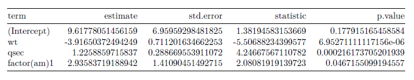
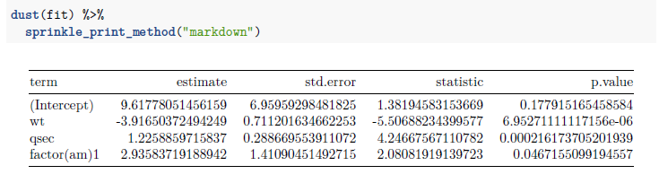

The most basic medley that ships with `pixiedust` is `medley_bw`.  It is characterized by 

* A solid line border above the top of the table header
* A solid line border below the bottom row of the table header
* A solid line border below the bottom row of the table body

### Sample Table

The sample table for this medley is built from a linear model.

```{r}
library(pixiedust)

fit <- lm(mpg ~ wt + qsec + factor(am),
          data = mtcars)
```

## Appearance

### Console Output

As illustrated below, `medley_bw` has no real impact on console output.

```{r}
dust(fit) %>%
  medley_bw() %>%
  sprinkle_print_method("console")
```

### Markdown Output (Rendered to HTML)

Since the markdown output is rendered via `knitr::kable`, this particular medley has no real impact on `markdown` output when rendered to HTML.

```{r}
dust(fit) %>%
  medley_bw() %>%
  sprinkle_print_method("markdown")
```

### Markdown Output (Rendered to LaTeX)

While it appears that `medley_bw` has been applied to the LaTeX output shown below, the formatting is actually the default formatting from `knitr::kable`.

```{r}
dust(fit) %>%
  medley_bw() %>%
  sprinkle_print_method("markdown")
```



Observe that nothing changes when we remove `medley_bw` from the code.

```{r}
dust(fit) %>%
  sprinkle_print_method("markdown")
```



### HTML Output

```{r}
dust(fit) %>%
  medley_bw() %>%
  sprinkle_print_method("html")
```


### LaTeX Output

```{r, eval = FALSE}
dust(fit) %>%
  medley_bw() %>%
  sprinkle_print_method("latex")
```


### LaTeX Output with hhline

```{r, eval = FALSE}
dust(fit,
     hhline = TRUE) %>%
  medley_bw() %>%
  sprinkle_print_method("latex")
```